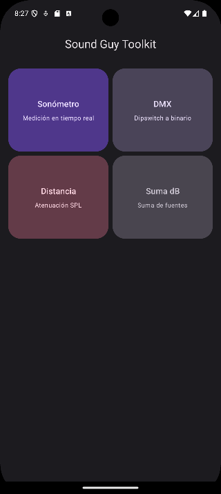
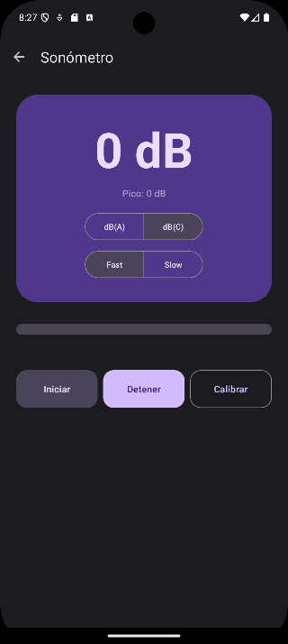
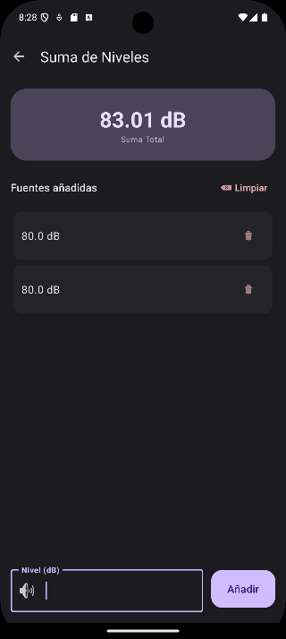
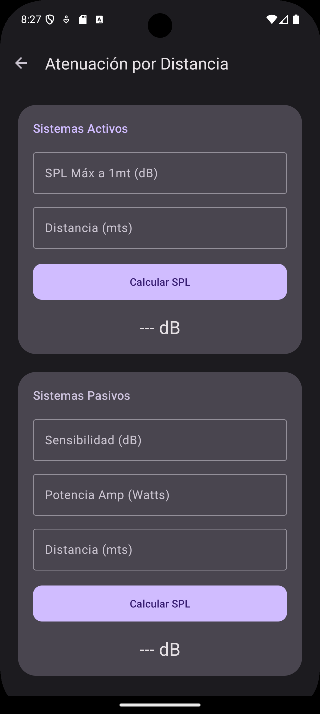
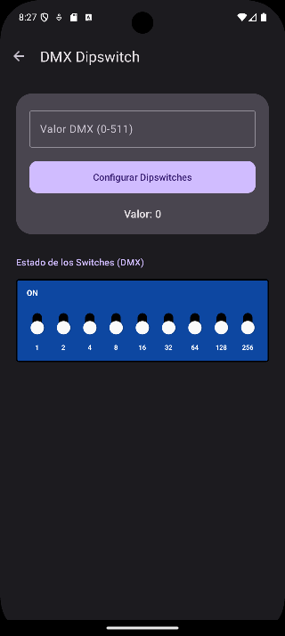

# SoundGuyToolkit 🎧

[](https://developer.android.com/android)
[](https://kotlinlang.org/)
[](https://m3.material.io/)

**SoundGuyToolkit** es una navaja suiza para ingenieros y técnicos de sonido. Esta aplicación combina herramientas críticas de cálculo acústico con un sistema de medición profesional, permitiendo realizar ajustes rápidos y precisos en el campo de trabajo.

---

## 🔥 Funcionalidades Principales

### 1. Sonómetro Profesional
Una herramienta de medición robusta que va más allá de un simple medidor de volumen:
*   **Filtros de Ponderación:** Selección entre **dB(A)** (ruido ambiental/salud laboral) y **dB(C)** (sistemas de PA y conciertos) según normas IEC 61672.
*   **Respuesta Temporal:** Modos **Fast (125ms)** y **Slow (1s)** para capturar picos o niveles promedio estables.
*   **Calibración Personalizada:** Permite ajustar un *offset* de nivel utilizando un sonómetro de referencia externo. La calibración es **persistente** (se guarda en el dispositivo).
*   **Captura de Picos:** Registro en tiempo real del valor máximo detectado.

### 2. Suma de Niveles Acústicos
Algoritmo preciso para calcular la interacción de múltiples fuentes de sonido:
*   **Lógica de Potencia:** Suma logarítmica real ($10 \cdot \log_{10}(\sum 10^{L_i/10})$). Ejemplo: 80 dB + 80 dB = 83.01 dB.
*   **Interfaz Dinámica:** Lista interactiva que permite añadir y eliminar múltiples fuentes, con actualización del resultado en tiempo real.

### 3. Calculadora DMX Dipswitch
Interfaz visual realista para configurar equipos de iluminación:
*   **Diseño Realista:** Simulación de un bloque de interruptores físicos con orientación vertical.
*   **Numeración Binaria:** Etiquetas claras (1, 2, 4... 256) para facilitar la comprensión técnica.
*   **Conversión Bidireccional:** Calcula la dirección desde el número decimal o viceversa tocando los switches.

---

## 🛠 Stack Técnico

*   **Lenguaje:** Kotlin
*   **UI:** XML con Material Design 3 (Componentes modernos como CardViews, ToggleGroups y RecyclerViews).
*   **Procesamiento de Audio:**
    *   Uso de `AudioRecord` para captura de audio "en crudo" (PCM 16-bit).
    *   Implementación de filtros digitales **Biquad IIR** para las curvas A y C.
    *   Cálculo de energía mediante **Exponential Moving Average (EMA)** para el pesaje temporal.
*   **Persistencia:** `SharedPreferences` para el almacenamiento de datos de calibración.

---

## 📸 Capturas de Pantalla

| Inicio | Sonómetro | Suma dB |
| :---: | :---: | :---: |
|  |  |  |

| Atenuación | DMX Dipswitch |
| :---: | :---: |
|  |  |

---

## 🚀 Instalación y Uso

1.  Clona este repositorio:
    ```bash
    git clone https://github.com/TU_USUARIO/SoundGuyToolkit.git
    ```
2.  Abre el proyecto en **Android Studio**.
3.  Asegúrate de otorgar el permiso de **Micrófono** al iniciar la aplicación.
4.  ¡Listo! Úsalo en tu próximo evento o instalación.

---

## 👨‍💻 Autor

**Tu Nombre**
*   LinkedIn: [LinkedIn](https://www.linkedin.com/in/eduardo-pinto-android)
*   Portfolio: [GitHub](https://github.com/eddiexspansk)

---

## ⚖️ Licencia

Este proyecto está bajo la Licencia MIT. Consulta el archivo `LICENSE` para más detalles.
